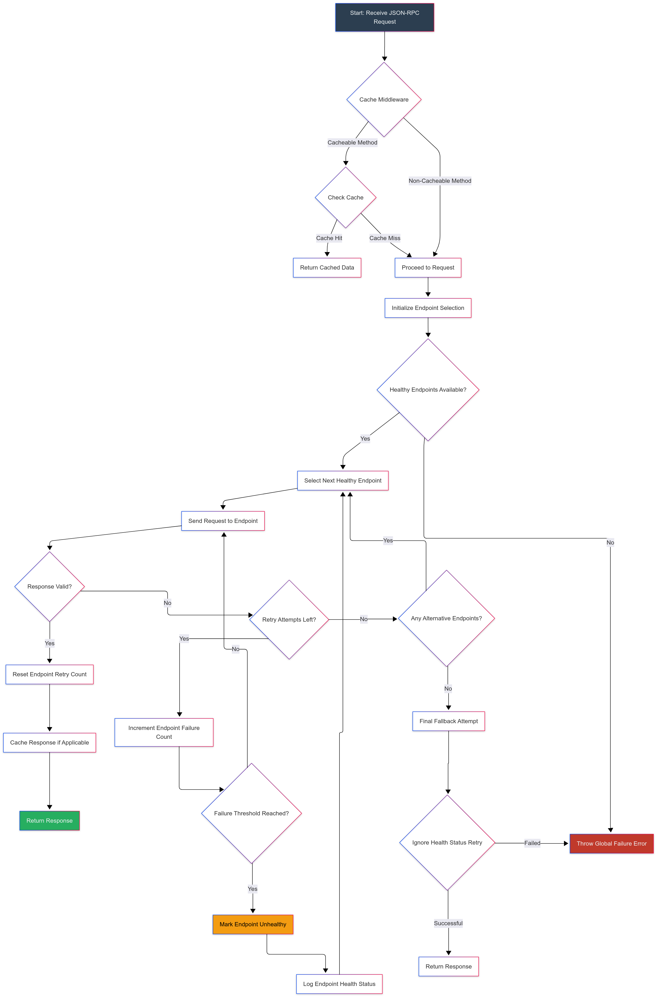
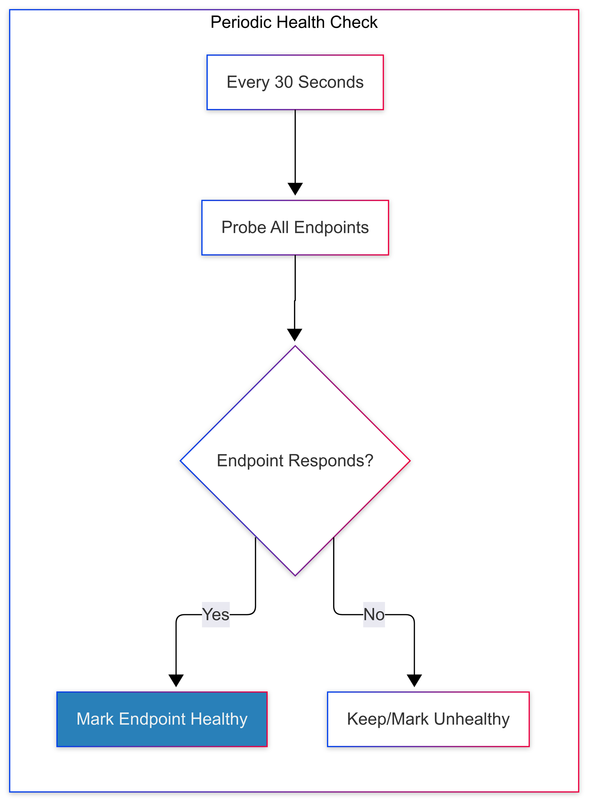

# Blockchain RPC Provider

A robust multi-chain RPC provider middleware with automatic failover, health monitoring, and caching capabilities for blockchain applications.




## 🚀 Features

- **Multi-chain Support**: Ethereum, BSC, Solana, Base networks
- **Smart Retry Mechanism**: Automatic failover between endpoints with exponential backoff
- **Health Monitoring**: Real-time endpoint status tracking and block height monitoring
- **Caching Layer**: Redis-backed response caching with stale-while-revalidate pattern
- **Error Reporting**: Integrated Sentry error tracking with contextual metadata
- **Type Safety**: Full TypeScript support with comprehensive type definitions
- **Configurable**: Flexible configuration for different deployment scenarios

## 📋 Supported Networks

| Blockchain | Networks               | Provider Type |
|------------|------------------------|---------------|
| Ethereum   | Mainnet, Sepolia, Testnet | Custom RPC |
| BSC        | Mainnet, Testnet       | Ankr API |
| Solana     | Mainnet, Devnet        | Ankr API |
| Base       | Mainnet, Sepolia       | Custom RPC |

## 📦 Installation

```bash
npm install blockchain-rpc-provider
```

## 🏃‍♂️ Quick Start

### Basic Usage

```typescript
import { getProvider, ProviderConfig } from 'blockchain-rpc-provider';

// 1. Configure your RPC endpoints
const NETWORK_ENDPOINTS = {
  ethereum: {
    mainnet: [{
      url: 'https://mainnet.infura.io/v3/YOUR_INFURA_KEY',
      maskedUrl: 'https://mainnet.infura.io/v3/****',
      healthCheck: {
        method: 'eth_blockNumber',
        params: []
      }
    }]
  }
};

// 2. Setup provider configuration
const providerConfig: ProviderConfig = {
  getRedisClient: () => yourRedisClient,
  sendErrorToSentry: (err, tags, level) => yourSentryFunction(err, tags, level),
  allowStaleOnFailure: true,
  requestIdCounter: 1,
  isCacheEnabled: true,
  cacheAbleMethods: ['eth_getBalance', 'eth_blockNumber'],
  ankrConfig: { API_KEY: 'YOUR_ANKR_API_KEY' },
  infuraConfig: { API_KEY: 'YOUR_INFURA_PROJECT_ID' },
  endpoints: [],
  rpcEndpoints: NETWORK_ENDPOINTS
};

// 3. Get provider and make requests
const provider = getProvider('ethereum', 'mainnet', providerConfig);
const balance = await provider.sendAsync({
  method: 'eth_getBalance',
  params: ['0x742d35Cc6634C0532925a3b8D4C9db96C4b4d8b6', 'latest']
});
```

### Using Ankr API (for BSC and Solana)

```typescript
import { getProvider } from 'blockchain-rpc-provider';

const providerConfig = {
  // ... other config
  ankrConfig: { API_KEY: 'YOUR_ANKR_API_KEY' },
  rpcEndpoints: {} // Not needed for Ankr API
};

// Solana Mainnet
const solanaProvider = getProvider('solana', 'mainnet', providerConfig);

// BSC Mainnet  
const bscProvider = getProvider('bsc', 'mainnet', providerConfig);
```

## ⚙️ Configuration

### ProviderConfig Interface

```typescript
interface ProviderConfig {
  getRedisClient: () => any;                    // Redis client factory
  sendErrorToSentry: (err: Error, tags: Record<string, string>, level: SeverityLevel) => void;
  allowStaleOnFailure: boolean;                 // Serve stale cache on failure
  requestIdCounter: number;                     // Request ID counter
  isCacheEnabled: boolean;                      // Enable/disable caching
  cacheAbleMethods: string[];                   // Methods to cache
  ankrConfig: AnkrConfig;                       // Ankr API configuration
  infuraConfig: InfuraConfig;                   // Infura API configuration
  endpoints: EndpointStatus[];                  // Endpoint status tracking
  rpcEndpoints: Record<string, Record<string, RpcEndpoint[]>>; // Custom RPC endpoints
}
```

### RPC Endpoint Configuration

```typescript
interface RpcEndpoint {
  url: string;                                  // RPC endpoint URL
  maskedUrl: string;                            // Masked URL for logging
  healthCheck: {                                // Health check configuration
    method: string;
    params: any[];
  };
  timeout?: number;                             // Request timeout (default: 10s)
}
```

## 🔧 Key Features Explained

### 🔄 Automatic Failure Handling

- **Retries**: 3 attempts with exponential backoff (1s, 2s, 4s)
- **Failover**: Round-robin through multiple endpoints
- **Health Checks**: Every 30 seconds, marks unhealthy nodes
- **Block Height Monitoring**: Detects stale nodes automatically

### 💾 Smart Caching

- **Redis Storage**: Persistent cache with configurable TTL
- **Stale-While-Revalidate**: Serve stale data during outages
- **Method-Specific TTLs**: Different cache durations per RPC method
- **Cache Invalidation**: Automatic invalidation on write operations

### 🛡️ Error Handling

- **Sentry Integration**: Automatic error reporting with context
- **Error Classification**: Network vs application errors
- **Secure Logging**: Masked endpoint URLs in logs
- **Contextual Metadata**: Request IDs, blockchain, network info

## 🏗️ Architecture

### Retry Logic
1. **Round-robin** between available endpoints
2. **Exponential backoff** for failed requests
3. **Skip unhealthy nodes** automatically
4. **Health recovery** detection

### Health Monitoring
1. **Continuous block height checks** every 30s
2. **5-second timeout** for health checks
3. **Automatic node recovery** detection
4. **Endpoint status tracking**

### Cache Layer
1. **Redis storage** for persistence
2. **Stale-while-revalidate** pattern
3. **Param-based cache keys**
4. **Configurable TTLs**

## 📚 Examples

### Get Account Balance

```typescript
const balance = await provider.sendAsync({
  method: 'eth_getBalance',
  params: ['0x742d35Cc6634C0532925a3b8D4C9db96C4b4d8b6', 'latest']
});
```

### Get Block Number

```typescript
const blockNumber = await provider.sendAsync({
  method: 'eth_blockNumber',
  params: []
});
```

### Call Contract Method

```typescript
const result = await provider.sendAsync({
  method: 'eth_call',
  params: [{
    to: '0x742d35Cc6634C0532925a3b8D4C9db96C4b4d8b6',
    data: '0x...'
  }, 'latest']
});
```

## 🚨 Error Handling

```typescript
try {
  const result = await provider.sendAsync({
    method: 'eth_getBalance',
    params: ['0x742d35Cc6634C0532925a3b8D4C9db96C4b4d8b6', 'latest']
  });
} catch (error) {
  // Error is automatically reported to Sentry
  console.error('RPC request failed:', error.message);
}
```

## 🔧 Development

### Building the Project

```bash
npm run build
```

### TypeScript Support

The package includes comprehensive TypeScript definitions for all interfaces and types.

## 📄 License

MIT License - see [LICENSE](LICENSE) file for details.

## 🤝 Contributing

1. Fork the repository
2. Create your feature branch (`git checkout -b feature/amazing-feature`)
3. Commit your changes (`git commit -m 'Add some amazing feature'`)
4. Push to the branch (`git push origin feature/amazing-feature`)
5. Open a Pull Request

## 📞 Support

For support and questions, please open an issue on GitHub.


